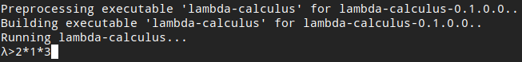
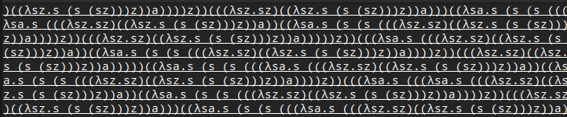

Referring to : https://github.com/Ema93sh/lambda-calculus-interpreter/blob/master/README.md

# Church Numeral Intepretation

Repo ini merupakan modifikasi dari repo [lambda-calculus-intepreter](https://github.com/Ema93sh/lambda-calculus-interpreter). Repo ini menambahkan input digit bilangan bulat dari 0 - 9, operasi pertambahan dengan simbol +, dan operasi perkalian dengan simbol *. Input tersebut akan diterjemahkan menjadi format Church Numeral dan dilakukan inferensi lambda calculus untuk mendapatkan hasil operasi bilangan dari input yang diberi dalam format church numeral dan diterjemahkan kembali ke format bilangan bulat.

## Modifikasi

1. Mengubah dependencies dari sandbox file dan .cabal

   Saya me-rename file sandbox project dan mengganti dependencies dalam file .cabal agar project dapat dijalankan dengan module base >= 4.9. Proyek dijalankan dengan command cabal run.

   [Rename sandbox config file](https://gitlab.cs.ui.ac.id/RafifEL/tugas5-funpro2020-muhammadrafifelfazri/-/commit/9623a8bd30dd8bf50945005c6b30f47f7f594bd6)

   [Change .cabal config file to resolve dependencies](https://gitlab.cs.ui.ac.id/RafifEL/tugas5-funpro2020-muhammadrafifelfazri/-/commit/20e3677e506fd5b12e92574ebeabcf39600e16d7) 

2. Penambahan kondisi pada parser untuk menerjemahkan angka.

   [Accepting only numeral string option to Church numeral](https://gitlab.cs.ui.ac.id/RafifEL/tugas5-funpro2020-muhammadrafifelfazri/-/commit/fcf0be34601d54da8e8eb136f10c569c8369f9f0) 

   [Change Index use to head function](https://gitlab.cs.ui.ac.id/RafifEL/tugas5-funpro2020-muhammadrafifelfazri/-/commit/379093b491954880884e01609a0ed7ff8602137d) 

   Fungsi parseExpr adalah fungsi untuk mem-parse ekspresi lambda calculus. Saya memodifikasi dengan menambahkan kondisi yang memeriksa apakah indeks pertama string tersebut adalah digit. Jika iya maka diproses terlebih dahulu agar menjadi format church numeral, lalu dimasukkan ke dalam fungsi parse dengan parameter seperti diatas.

3. Menambahkan module untuk menerjemahkan digit dan operasi penambahan dan perkalian ke lambda calculus

   Saya menambahkan sebuah modul Numeral yang berfungsi untuk menerjemahkan digit dan operasi pertambahan (+) dan perkalian (*) ke dalam bentuk church numeral.

   berikut representasi dari church numeral :

   ```
   \ = simbol untuk lambda
   0 ≡ (\sz.z)
   1 ≡ (\sz.s(z))
   2 ≡ (\sz.s(s(z)))
   ```

   Untuk mengikuti pattern diatas, saya mebuat suatu fungsi rekursif yang menerima argumen angka. fungsi tersebut diawali dengan menambahkan string "s( )" dan iterasi selanjutanya menambahkan string "s( )" ke dalam parentheses tersebut ("( )")  samai ke base case 0 dimana hanya menambahkan string "z" ke dalam parentheses. lalu hasil fungsi tersebut ditambah dengan head dari lambda calculus tersebut ("(\sz.s"+hasil_rekursi+")"). implementasi terdapat di fungsi intToChurchNumeral dan intToChurchNumeralHelper pada commit dibawah.

   [add new module for Church Numeral](https://gitlab.cs.ui.ac.id/RafifEL/tugas5-funpro2020-muhammadrafifelfazri/-/commit/a775ffa6089a897866f237da6b5baff9a7f3c3a0)

   Untuk menerjemahkankan sebuah operasi bilangan yang terdiri dari operasi pertambahan dan perkalian, maka saya membuat fungsi yang menerima argumen string dan string accumulator mengiterasi string opearsi tersebut secara rekursif. setiap menerima karakter digit dan simbol + maka string akumulator akan ditambahkan dengan Church numeral dari digit dan lambda calculus dari operasi penambahan. Jika menerima simbol *, maka string akumulator akan ditambahkan dengan lambda calculus dari operasi perkalian dan string akumulator akan "dibungkus" dengan parentheses "()".

   [allow Multi + and * operation (0-9 digit)](https://gitlab.cs.ui.ac.id/RafifEL/tugas5-funpro2020-muhammadrafifelfazri/-/commit/861bc6a7d22979f8b63aaea22f6b53b0de117cfc) 

   

4. Penerjemahan Kembali Church Numeral menjadi bilangan bulat biasa.

   Church Numeral dalam repo ini direprentasikan dalam format berikut.

   ```
   \ = simbol untuk lambda
   0 ≡ (\sz.z)
   1 ≡ (\sz.s(z))
   2 ≡ (\sz.s(s(z)))
   ```

   Dapat dilihat dari format diatas, setiap kemunculan argumen pertama variabel pertama dalam body dalam kumpulan lambda calculus diatas merpresentasikan bilangan bulat. Maka dari itu saya memanfaatkan pattern ini dalam menerjemahkan kembali lambda calculus tersebut.

   [Translate back from Church Numeral to Integer](https://gitlab.cs.ui.ac.id/RafifEL/tugas5-funpro2020-muhammadrafifelfazri/-/commit/d891f688e829d49ecb6b21107b7f5012d1e871c0) 

   Melihat fungsi churchtoIntApprox dalam commit diatas, fungsi tersebut mem-filter string hasil inferensi lambda calculus tersebut dengan argumen pertama dari lambda calculus tersebut (karakter index 1 dari string tersebut) dan kemudian saya menghitung panjang hasil dari filter lalu dikurangi 1 untuk mendapatkan aproksimasi Integer dari lambda calculus tersebut.

   Setiap proses inferensi dari lambda calculus, saya selalu menghitung aproksimasi dari Integer dari lambda calculus tersebut, walaupun lambda calculus tersebut bukan church numeral.

   ```haskell
   [expr]          -> do s <- lift get; outputStrLn (evaluate expr s); outputStr (churchtoIntApprox(last (splitOn "\n" (evaluate expr s))))
   ```

   terlihat dari line code di atas saya memanggil fungsi evaluate ulang untuk mendapatkan hasil kembali. saya menggunakan split pada hasil tersebut karena hasil evaluate multiline dan saya hanya membutuhkan line terakhir dari output tersebut.

## Bugs

Bugs yang saya temukan adalah saat menerima fungsi perkalian yang melibatkan lebih dari 2 angka dan diawali dengan angka lebih dari 1, maka proses inferensi akan jatuh di state infinite loop. Menurut saya ini bugs yang sudah ada dari repo awal.

Input bug:



Output bug:

